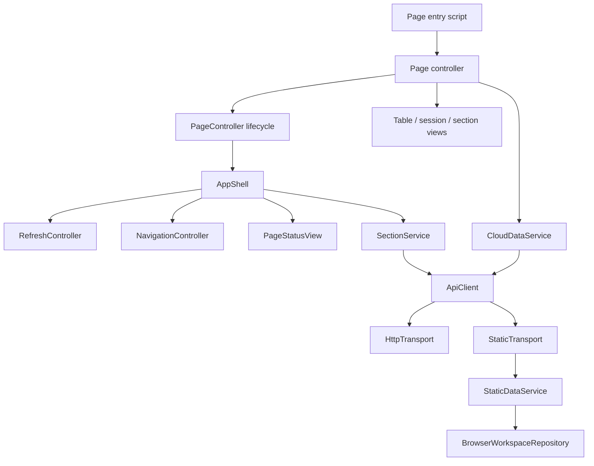
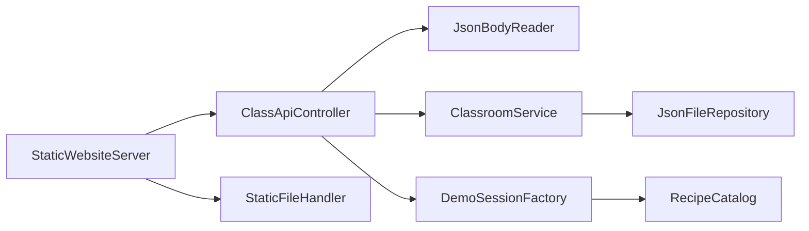

# Object-oriented project structure

The website uses small classes with explicit responsibilities and constructor-injected collaborators. The refactor preserves the page URLs, API routes, JSON files, browser-storage keys, recipe definitions, and prototype features. It adds no dependencies.

## Browser application

| Location under `public/assets/js/` | Responsibility |
| --- | --- |
| `pages/` | Exported `LoginPage`, `DashboardPage`, `StudentsPage`, `SessionsPage`, and `ReportsPage` controllers. |
| `app/page-controller.js` | Shared protected-page lifecycle: initialize the shell, install controls, then start recoverable data loading. |
| `app/app-shell.js` | Composes authentication, navigation, section selection, page status, and refresh scheduling. |
| `app/refresh-controller.js` | Polling, reconnect/visibility/storage events, queued refreshes, and timer/subscription cleanup. |
| `services/auth-service.js` | Prototype sign-in, cooldown, and password recovery. |
| `services/storage-service.js` | Browser preference and credential serialization with storage-error handling. |
| `services/section-service.js` | Section selection, creation/deletion requests, and protection against outdated loads. |
| `services/cloud-data-service.js` | Learner, activity, and session queries and response validation. |
| `services/api-client.js` | `ApiClient` delegates requests to an interchangeable transport. `StaticTransport` lazily opens the static demo. |
| `services/http-transport.js` | `HttpTransport` owns fetch, timeout, cancellation, and response errors. |
| `services/browser-workspace-repository.js` | `BrowserWorkspaceRepository` owns seeding, validation, persistence, and cross-tab locking. |
| `static-data.js` | `StaticDataService` handles static-demo queries and section mutations through its repository. |
| `views/` | `TableView`, `SectionSelector`, `NavigationController`, and `PageStatusView` render and manage their respective UI areas. |
| `sections.js`, `session-view.js` | Existing `SectionManager` and `SessionView` encapsulate section dialogs and recipe-session cards. |
| `domain/` | Scoring/dashboard metrics and `RecipeCatalog`, independent of DOM, fetch, and file storage. |
| `utils/html.js` | Shared HTML escaping. |

The original page scripts (`dashboard.js`, `students.js`, etc.) now only create and start their page controllers. Importing a controller module does not start the UI. `core.js` is a small compatibility facade that re-exports the existing public services and views.



## Node server and tools

| Class | Location | Responsibility |
| --- | --- | --- |
| `StaticWebsiteServer` | `src/server.js` | Starts the HTTP listener and delegates API/static requests. |
| `ClassApiController` | `src/controllers/class-api-controller.js` | Routes API requests and translates results/errors into HTTP responses. |
| `JsonBodyReader` | `src/http/json-body-reader.js` | Validates content type, body size, and JSON. |
| `StaticFileHandler` | `src/http/static-file-handler.js` | Resolves files within the public directory and serves their content. |
| `ClassroomService` | `src/services/classroom-service.js` | Section and enrollment validation, duplicate handling, deletion rules, and learner projections. |
| `JsonFileRepository` | `src/repositories/json-file-repository.js` | Serialized writes, atomic file replacement, and consistent snapshots. |
| `ClassStore` | `src/classes.js` | Compatibility constructor that supplies a file repository to `ClassroomService`. |
| `DemoLearnerSeeder` | `src/demo.js` | Adds/removes tagged sample enrollments without modifying real learners. |
| `DemoSessionFactory` | `src/demo-sessions.js` | Builds sample session records using an injected recipe catalog. |
| `StaticSiteBuilder` | `scripts/build-static.mjs` | Copies browser assets and writes static runtime configuration. |



## OOP conventions

- **Encapsulation:** Each object owns one area of state and behavior. Refresh timers belong to `RefreshController`; file-write serialization belongs to `JsonFileRepository`.
- **Composition:** The shell and server receive collaborators through constructors. Services use repositories rather than performing persistence directly.
- **Limited inheritance:** The four protected pages extend `PageController` because they share the same lifecycle. `LoginPage` remains separate because its flow is different. `ClassStore` preserves the old file-based constructor.
- **Polymorphism:** An `ApiClient` accepts any transport exposing `request(path, options)`. `ClassroomService` accepts a repository exposing `read()`, `snapshot()`, and `mutate(change)`.
- **Dependency injection:** Tests can supply in-memory repositories, fake fetch implementations, clocks, event targets, and schedulers without modifying globals or opening a real database.
- **Compatibility:** Existing `apiRequest`, `createStaticRequest`, `getRecipe`, `getRecipeProgress`, `demoSessions`, and demo-seeding functions delegate to the class implementations.
- **Plain data and utilities:** Recipe definitions, fixtures, HTML escaping, and scoring helpers remain plain data/functions. They do not need an artificial object lifecycle.

To add a protected page, extend `PageController`, install its handlers in `setup()`, and load/render data in `refresh()`. Let refresh failures reach the shared status handler. For a different data source, supply a transport to `ApiClient`; the page does not need to know how requests are executed.

```js
const client = new ApiClient(new HttpTransport({ fetchImpl: customFetch }));
const sections = new SectionService(store, client.request.bind(client));
```

`RefreshController.stop()` removes its timer and event subscriptions. Restarting it invalidates any older pending refresh. `AppShell.dispose()` stops refresh scheduling and navigation subscriptions. Ordinary page navigation still uses separate HTML documents.

## Validation and scope

The automated suite covers the previous feature/failure scenarios plus repository substitution, transport isolation, loader recovery, independent recipe catalogs, refresh coalescing/disposal/restart, and page lifecycle ordering. Run `npm.cmd test` and `npm.cmd run build` from the application directory. Run `node .preview/check.mjs` and `node .preview/check.mjs --static` from the repository root for Chrome workflow checks.

This organization does not add production authentication, Unity telemetry, or report downloads. It refactors the website runtime and build tooling; the current checkout contains no Unity C# source files.
